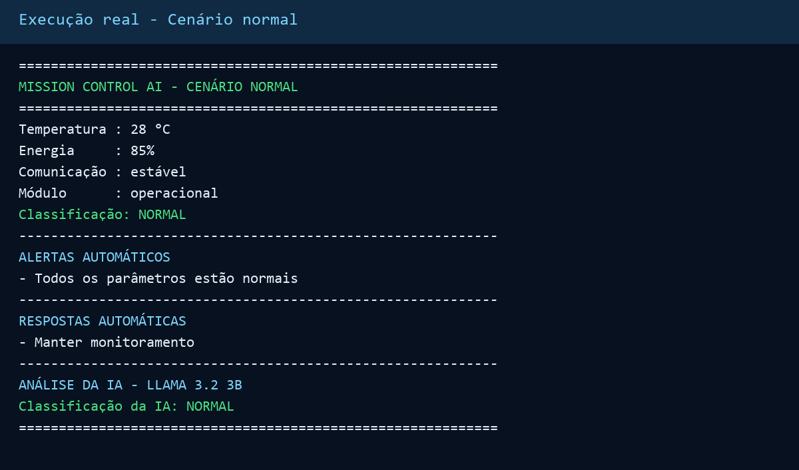
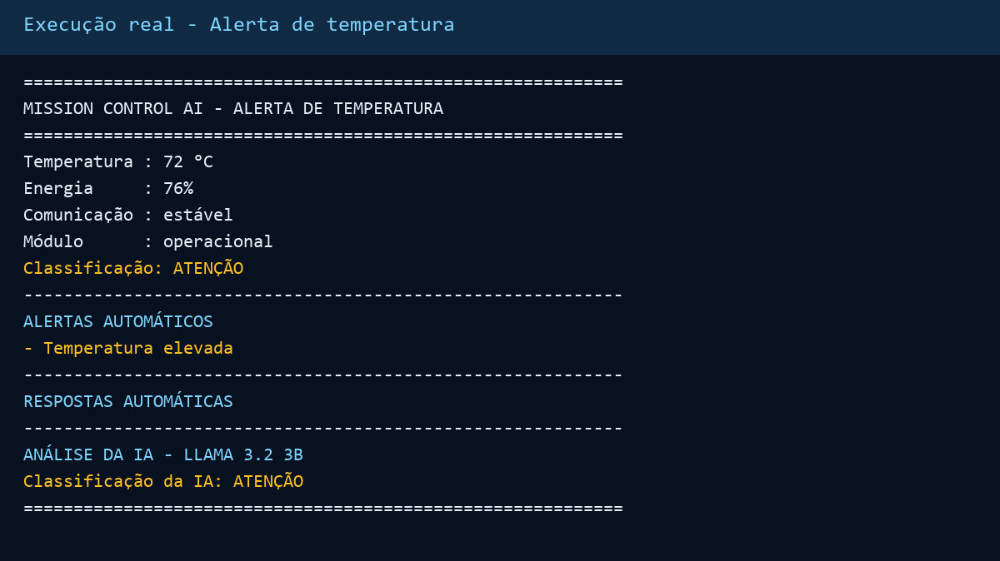
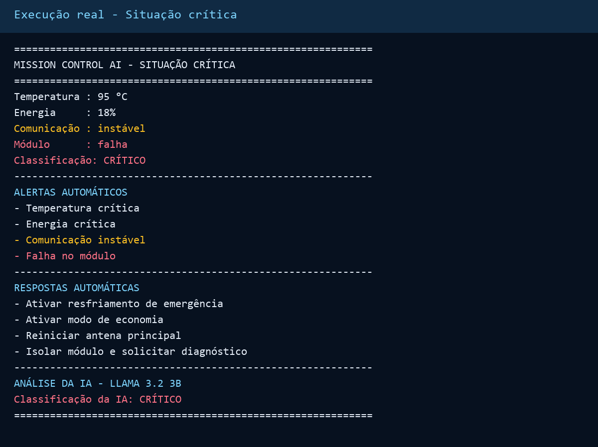
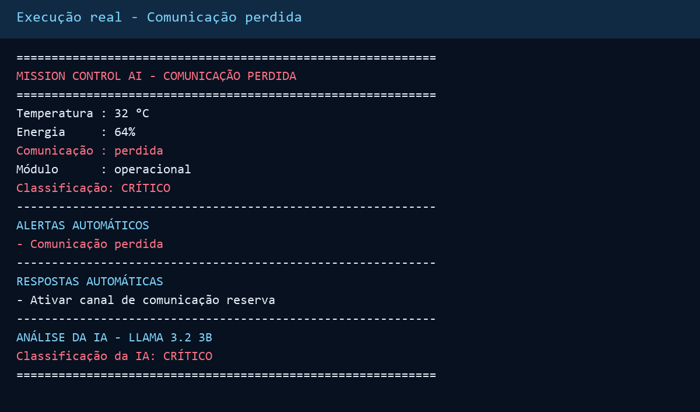

# Mission Control AI

## Integrantes

- Angela Takezawa - RM: 570797
- Rodrigo Zambelle - RM: 570425
- Rodrigo Fidelis Zarzar Santana - RM: 572454

## O que o projeto faz

O Mission Control AI é um sistema em Python que simula o monitoramento de uma
missão espacial. Ele acompanha temperatura, energia, comunicação e status do
módulo, gera alertas automáticos e usa o modelo Llama 3.2 3B via Ollama para
analisar os dados e recomendar ações.

## Funcionalidades

- Geração de dados simulados da missão.
- Monitoramento de quatro parâmetros operacionais.
- Alertas automáticos para valores fora do normal.
- Decisão automática para situações críticas.
- System prompt com contexto de controle de missão.
- Resposta do Llama exibida junto aos dados.
- Cenários normal, crítico e aleatório.

## Demonstração

### Cenário normal

### Alerta de temperatura

### Situação crítica

### Resposta da IA

## Como executar

Abra o notebook no Google Colab:

[Acessar o Mission Control AI no Colab](https://colab.research.google.com/github/woowoo88/GS_PROMPT-AND-AI/blob/main/Mission_Control_AI.ipynb)

1. No Colab, clique em **Ambiente de execução > Executar tudo**.
2. Aguarde a instalação do Ollama e o download do modelo.
3. Veja os cenários normal, crítico e aleatório nos últimos blocos.

Na primeira execução, o download do modelo pode levar alguns minutos.

## Tecnologias

- Python
- Google Colab
- Ollama
- Llama 3.2 3B

Foi usada a versão 3B da família Llama porque ela apresentou classificações
mais consistentes nos testes dos cenários normal, de atenção e crítico.

## Regras de decisão

| Parâmetro | Condição crítica | Resposta automática |
|---|---|---|
| Temperatura | Acima de 80 °C | Ativar resfriamento de emergência |
| Energia | Abaixo de 20% | Ativar modo de economia |
| Comunicação | Instável ou perdida | Reiniciar antena e usar canal reserva |
| Módulo | Falha | Isolar o módulo e solicitar diagnóstico |

## Vídeo de demonstração

O vídeo será gravado e publicado externamente. O arquivo de vídeo não faz parte
do repositório.

**Link:** PREENCHER APÓS PUBLICAR O VÍDEO
