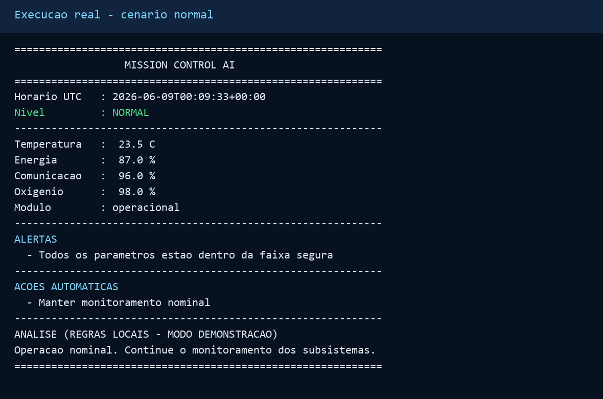
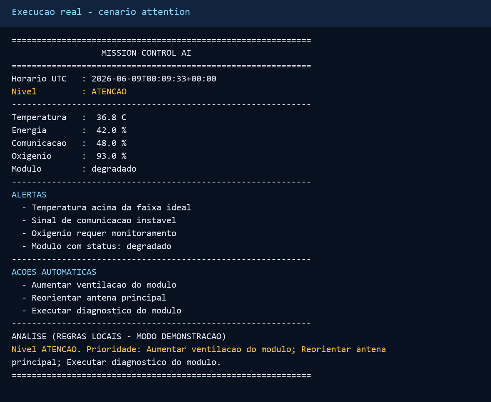
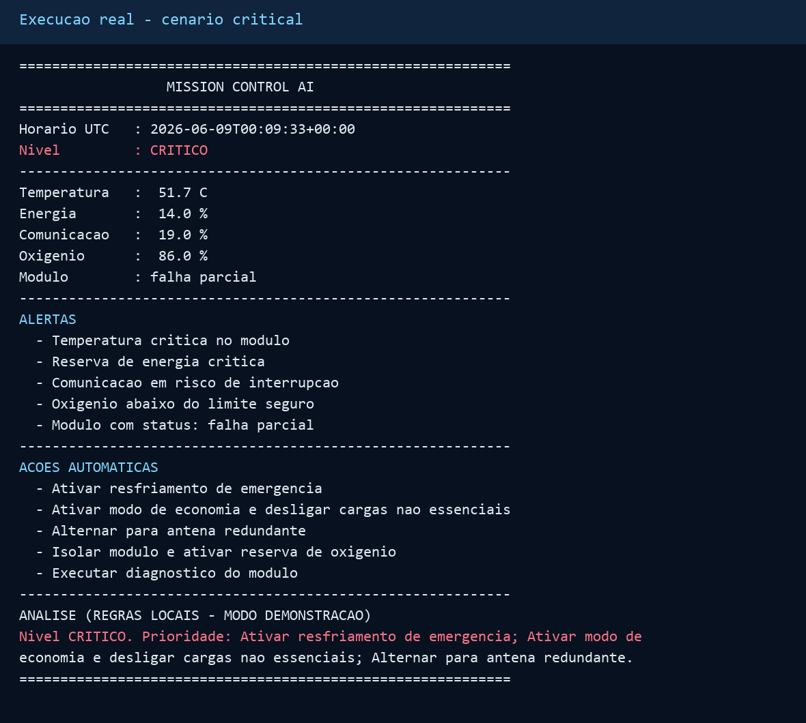
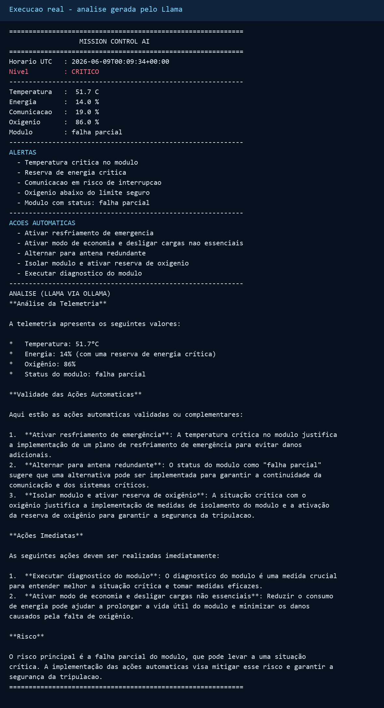

# Mission Control AI

**Integrantes**

- PREENCHER NOME COMPLETO - RM: PREENCHER

## Sobre o projeto

Sistema inteligente de monitoramento de uma missao espacial experimental. A
aplicacao gera ou recebe telemetria de temperatura, energia, comunicacao,
oxigenio e estado do modulo, aplica regras automaticas de seguranca e usa o
modelo Llama 3.2 1B via Ollama para analisar riscos e recomendar acoes.

O projeto combina duas camadas:

- **Regras deterministicas:** alertas e respostas de emergencia continuam
  funcionando mesmo sem conexao com o modelo.
- **IA generativa:** um system prompt especializado orienta o Llama a validar os
  alertas e priorizar ate tres acoes para a equipe de controle.

## Funcionalidades

- Geracao de dados simulados e tres cenarios reproduziveis.
- Monitoramento de cinco parametros operacionais.
- Classificacao em `NORMAL`, `ATENCAO` ou `CRITICO`.
- Ativacao automatica de economia de energia, resfriamento, antena redundante e
  reserva de oxigenio.
- Analise contextual com Llama via API local do Ollama.
- Contingencia local identificada claramente quando a IA estiver indisponivel.
- Testes automatizados da logica e da exibicao da resposta da IA.

## Demonstracao

### Operacao normal



### Parametros em atencao



### Situacao critica e respostas automaticas



### Analise apresentada pela IA



## Como executar no Google Colab

Abra o notebook:
[Mission_Control_AI.ipynb](Mission_Control_AI.ipynb)

No GitHub, clique em **Open in Colab** ou acesse:

https://colab.research.google.com/github/woowoo88/GS_PROMPT-AND-AI/blob/main/Mission_Control_AI.ipynb

Execute as celulas em ordem. O notebook instala o Ollama, inicia o servidor,
baixa o modelo `llama3.2:1b` e demonstra cenarios normal e critico.

## Como executar localmente

Requer Python 3.10 ou superior e
[Ollama](https://ollama.com/download).

```bash
ollama serve
ollama pull llama3.2:1b
python mission_control.py --scenario critical
```

Para demonstrar apenas as regras locais, sem iniciar o modelo:

```bash
python mission_control.py --scenario normal --no-ai
python mission_control.py --scenario attention --no-ai
python mission_control.py --scenario critical --no-ai
```

Os cenarios disponiveis sao `normal`, `attention`, `critical` e `random`.

## Testes

```bash
python -m unittest discover -s tests -v
```

## Tecnologias

- Python 3
- Llama 3.2 1B
- Ollama
- Google Colab
- API HTTP local do Ollama
- Pillow para gerar as evidencias visuais

## Decisoes automaticas

| Condicao | Nivel | Resposta |
|---|---|---|
| Temperatura >= 45 C | Critico | Ativar resfriamento de emergencia |
| Energia < 20% | Critico | Economia e desligamento de cargas |
| Sinal < 25% | Critico | Alternar para antena redundante |
| Oxigenio < 90% | Critico | Isolar modulo e ativar reserva |
| Desvio moderado | Atencao | Correcao preventiva correspondente |

## Video de demonstracao

O video nao e armazenado neste repositorio. Depois da gravacao, publique-o em
um servico externo e substitua o campo abaixo:

**Link:** PREENCHER LINK DO VIDEO

Use o [roteiro de gravacao](ROTEIRO_VIDEO.md) para demonstrar todos os criterios
em ate 3 minutos.

## Estrutura

```text
.
|-- Mission_Control_AI.ipynb
|-- mission_control.py
|-- tests/
|-- scripts/
|-- assets/
|-- ROTEIRO_VIDEO.md
|-- entrega.txt
`-- README.md
```
